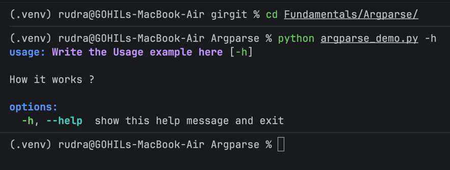
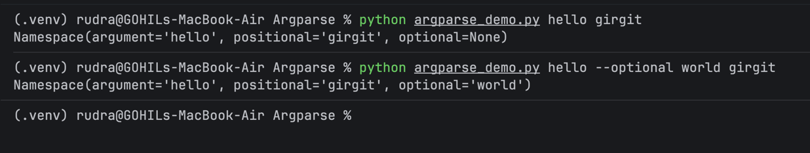
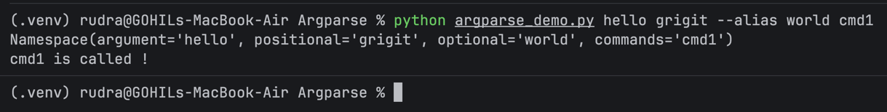

## Argparse

> It is used to *parse* CLI arguments into structured python object 
> easily ! The parser output is a namespace object (similar to **env** or **scope** , well **scope** is the region
> and *Namespace* is the dictionary storing name <-> value pair inside that region)

### Options:

The only option we get without specifying is `--help` or `-h`.

```python
import argparse

parser = argparse.ArgumentParser("Write the Usage example here" , description= "How it works ?")

args = parser.parse_args()
```


---

### Types of Arguments : Optional and Positional

> Optional argument : looks like `--arg` which is optional 
> as the name suggest and can have alias names too :)

> Optional arguments can also be used to store flags i.e when the option like `--verbose` is used... to  auto take the input as
> true when used we write : `action = "store_true"`
> thus when `--verbose` will be used it will take value `True`

ex : `parser.add_argument("--optional","--alias")`

> Positional argument : It doesn't have alias name and the elements are stored in
> positional order as defined in code !

ex : 

`parser.add_argument("argument",help="Summary that will be shown in --help")`

`parser.add_argument("positional")`

**Here `argument` will store the first argument and `positional` will store the next one.**

Also in both types we can add the *type*,*default* and *help*

```python
import argparse

parser = argparse.ArgumentParser("Write the Usage example here" , description= "How it works ?")

parser.add_argument("argument",help="Summary that will be shown in --help")

parser.add_argument("positional")

parser.add_argument("--optional","--alias")

args = parser.parse_args()

print(args)
```

**Note : when Positional arguments are used we need to include them strictly !**



---

## Sub-commands :

> Some Programs like **(git,svn)** have multiple commands
> Each command has a different job and may need different arguments.
> Thus *Subparser* are used !
>

```python
import argparse

parser = argparse.ArgumentParser("Write the Usage example here" , description= "How it works ?")

parser.add_argument("argument",help="Summary that will be shown in --help")

parser.add_argument("positional")

parser.add_argument("--optional","--alias")

subparser = parser.add_subparsers(dest="commands")

subcmd1_parser = subparser.add_parser("cmd1")


args = parser.parse_args()
print(args)

if args.commands == "cmd1":
    print("cmd1 is called !")

```

Here `dest` is used store the name of subcommand user choose for later use !



- `help=` → shown in the main help (`python prog.py -h`)
- `description=` → shown in subcommand help (`python prog.py cmd1 -h`)