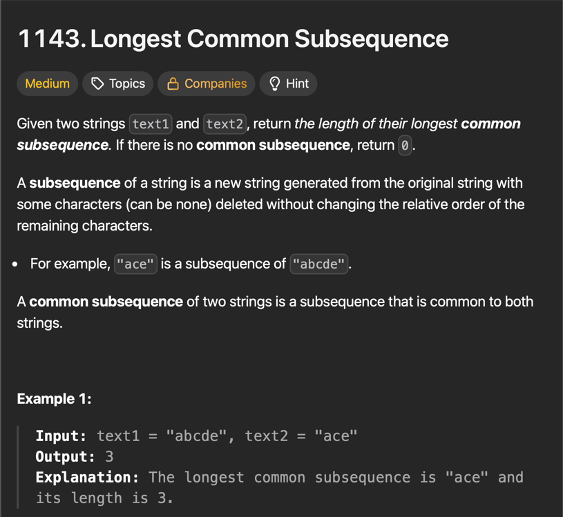
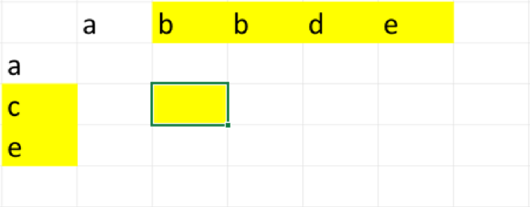
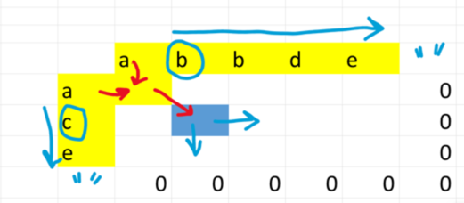

# Largest Common Subsequence : First step to understand diff



The explanation is based on [NeetCode solution](https://www.youtube.com/watch?v=Ua0GhsJSlWM&t=33s).

First of all this problem will be solved with dynamic programming,
but the main challenge of dp problems is `finding the subproblem` on which we
can recurse...

## Approach :

> let the 2 strings be : ***abcde*** and ***ace*** 
>
> ```
>  -------------------           -----------
> | a | b | c | d | e |   and   | a | c | e |
>  -------------------           -----------
> 
> here if we go char by char from smaller string to the bigger
> one : we will first take 'a' from "ace" and there we can see 
> that it matches with 'a' from "abcde" thus our result will 
> be :
>   
>   LCS ("bcde","ce") + 1 (due to the matching 'a's)
> 
> * What if 'a' didn't matched i.e the char doesn't match ?
> 
>   lets take LCS ("bcde","ce") for example :
>       
>   here 'c' != 'b' :
>           
>   Therefore the result will be :
> 
>       Max { LCS("bcde" , "e") , LCS("cde" , "ce") }         
>   
>   And the algorithm then rescurse So that is basically
>   the whole algorithm
```
The code :
    @cache
    def LCS(str1 , str2):
        
        if str1 == "" or str2 == "":
            return 0
        
        if str1[0] == str2[0] :
            return 1 + LCS( str1[1:] , str2[1:] )
            
        else :
            return max ( LCS(str1[1:] , str2 ) , LCS( str1 , str2[1:]) )
        
```

Sadly this code wouldn't pass on leetcode due to `high memory
usage` as it is a Top-down solution, so to reduce memory usage
we will use `Bottom-Up` approach.


## Bottom - up :

We can see that one operation we do to solve this problem is
to solve the sub-problem which can be defined as "compare 
sub-strings of str1 with str2" but what we compare, changes and
depends on if the character match. But this points us
to find a way to compare substrings and one way to see this 
is using a `grid`.

### What does the grid represent : 

Ex :



The yellow box represents the largest common
subsequence between those yellow strips.

### Solution :



As per our algorithm , Here `'a'` matches
of both the strings that means the
answer we write in yellow box will be
`LCS( "bbde" , "ce" ) + 1` 

for `LCS( "bbde" , "ce" )` :
Here `'b'` and `'c'` doesn't 
match thus we will find the : 

`max { LCS( "bde" , "ce" ) , LCS( "bbde" , "e" )`} 
as per our algo but what does `LCS( "bde" , "ce" )` means ?
It is the box right of our blue box !

So we can see that we are moving at the
bottom of table so that we can find our
final result which will be `grid[0][0]`, but
to find that we need to start filling the boxes
from the bottom i.e. bottom-up approach.

Also that blue `""` represent empty string acting
as base case here and as LCS with empty string will
always be `0`we prefill them with 0.

So Now the code for this becomes :

```python

class Solution:
    def longestCommonSubsequence(self, text1: str, text2: str) -> int:
        grid = [ [ 0 for _ in range(len(text1)+1) ] for _ in range(len(text2)+1) ]
        
        for i in range(len(text2)-1 , -1 , -1):
            for j in range(len(text1)-1 , -1 , -1):
                if text2[i] == text1[j]:
                    grid[i][j] = grid[i+1][j+1] + 1
                else :
                    grid[i][j] = max(grid[i+1][j] , grid[i][j+1])
        
        return grid[0][0]


```

PS : The Problem can be solved by Top-Down approach too
In previous code the issue was :
- slicing strings (str1[1:]) creates new strings repeatedly

We can use indices instead, and it goes like this :

```python

class Solution:
    def longestCommonSubsequence(self, text1: str, text2: str) -> int:
        @cache
        def LCS(i,j):
            if i == len(text1) or j == len(text2):
                return 0
            if text1[i] == text2[j]:
                return 1 + LCS(i+1,j+1)
            else:
                return max(LCS(i+1,j) , LCS(i,j+1))
        return LCS(0,0)

```

But we needed to see Bottom-up for Meyer's algorithm
as our end-goal is creating a diff function.

