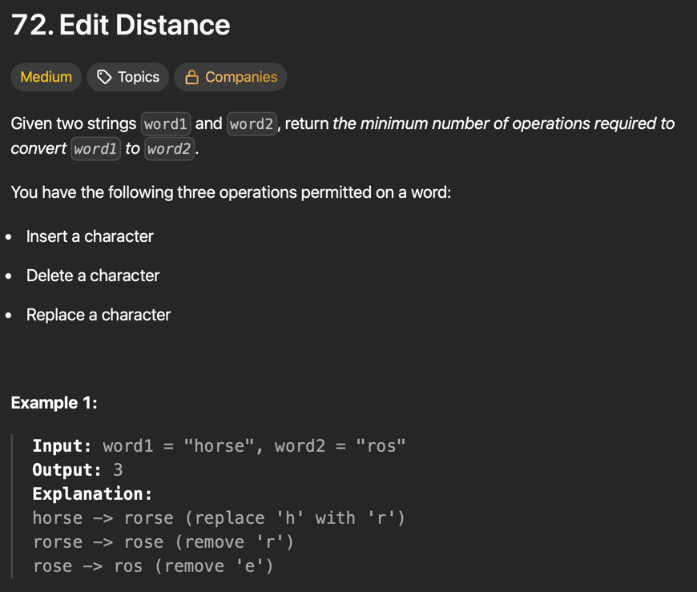
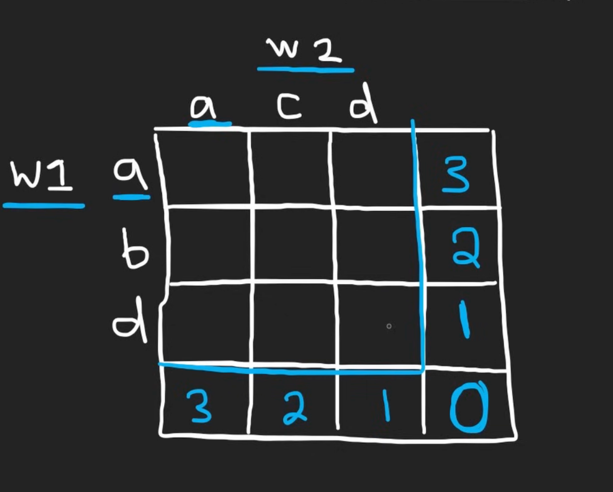

# Levenshtein(Edit Distance) : The next step in diff

> As we saw :  
> 
> Largest Common Subsequence answered : ***What is the longest sequence both strings share ?***
> 
> Levenshtein  answers : ***"What is the minimum number of steps require to transform one string to other"***
> 

So ain't Levenshtein just : 

EditDistance ( A , B ) = ∣ A ∣ + ∣ B ∣ − 2 ⋅ LCS( A , B )

because LCS gives the Largest common sequence and thus
no. of edits means deleting the other chars from both
string not present in LCS / inserting the extra chars
in of string to the other.

But Levenshtein allows `replace`  along with
`delete` and `insert` so we will need to solve it the
old fashion way using dp like we did for LCS.

Again it is based on [Neetcode Solution](https://www.youtube.com/watch?v=XYi2-LPrwm4).



## Approach :

> let the 2 strings be : ***abcde*** and ***ace*** 
>
> ```
>  -------------------           -----------
> | a | b | c | d | e |   and   | a | c | e |
>  -------------------           -----------
> ^                               ^
> |                               |
> 
> Ptr-1                          Ptr-2
> 
> ```
> We want to convert **"abcde"** to **"ace"**
> Again like LCS we will go _**char by char matching**_
> in both strings.
> 
> so the first char is `'a'` in both string , thus 
> no operation is required to be performed for transformation
> now the result will be `0 + EditDistance("bcde","ce")` i.e. moving
> both the pointers by 1 to the right
> 
> **_When the char doesn't match like in `"bcde"` and `"ce"` ?_**
> 
> In that case we have 3 possible choices :
> `insert` or `delete` or `replace`
> 
> ### Insert
> let's say we inserted a `'c'` before `'b'` in `"bcde"` to match
> it with `'c'` in `"ce"`
> 
> thus `ptr-2` will be shifted +1 to the right.
> but `ptr-1` remains at the same location  
> 
> Thus: `1 + EditDistance("bcde","e")`
> 
> ### Delete
> If we deleted the `'b'` then `ptr-1` will shift +1 to the right
> where as `ptr-2` still stays at the same location.
> 
> Thus : `1 + EditDistance("cde","ce")`
> 
> ### Replace
> If we replace the `'b'` and change it to `'c'` then `ptr-1` will shift +1 to the right
> and `ptr-2` also shifts +1 to the right
> 
> Thus : `1 + EditDistance("cde","e")`
> 
> 
> The `min` from the 3 operation will be the answer.
> 
>### Base cases :
> 
> There are 3 possible base cases :
> 
> #### 1) EditDistance( "" , word-2) : 
> word-1 is `""` and word-2 say is `"cow"` then to transform the 
> empty string to "cow" will require `3` insert operation basically
> `len(word-2)`.
> 
> #### 2) EditDistance(word-1 , "") : 
> word-1 is `"cow"` and word-2 say is `""` then to transform the 
> `"cow"` string to `""` will require `3` delete operation basically
> `len(word-1)`.
> 
> #### 3) EditDistance( "" , "") : 
> It will be `0` as both are equal.
> 
> 

> Like the LCS we will solve the same with Bottom-up dp and the table 
> looks like :



> **_grid [i] [j]  means: minimum edits required to convert: word1[ j : ] into
word2[ i : ]._**

## Code :

```python

class Solution:
    def minDistance(self, word1: str, word2: str) -> int:
        i=j=0

        grid = [ [float("inf") for _ in range(len(word1)+1)] for _ in range(len(word2)+1)] # for finding minimum, we keep float("inf") as default
        
        # Base case :
        for i in range(len(word2)+1):
            grid[i][len(word1)] = len(word2)-i
        
        for j in range(len(word1)+1):
            grid[len(word2)][j] = len(word1)-j

        print(grid)
        
        # Levenshtein algo
        for i in range(len(word2)-1,-1,-1):
            for j in range(len(word1)-1,-1,-1):
                if word1[j] == word2[i]:
                    grid[i][j] = grid[i+1][j+1]
                else:
                    grid[i][j] = min( grid[i+1][j] , grid[i][j+1] , grid[i+1][j+1]) + 1
        return grid[0][0]

        
```
