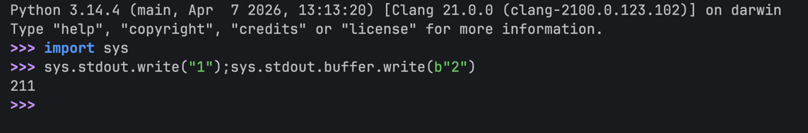

These are some tid-bits of code which personally I didn't understand when reading Nikita's code so
i am making an effort to convey the ***Why*** of the code.

### 1. Why flush before ? 

#### The Code :

```python
import sys

def cat_file (args):
    sys.stdout.flush ()
    sys.stdout.buffer.write (data.get_object (args.object))

```

#### The Doubts :

>(Comment #297) aaron @ 14/5/2023, 11:34:21 AM:
Why don't use flush the stdout after the write instead of before the write?

>(Comment #298) Nikita (author) @ 14/5/2023, 3:13:46 PM:
#297 aaron: sys.stdout is buffered but sys.stdout.buffer isn't. If we write to sys.stdout.buffer before flushing sys.stdout we might get output reordering.

>For example, the following command :  
```bash
python -c 'import sys; sys.stdout.write("1"); sys.stdout.buffer.write(b"2")'
```
>outputs "21" when I run it in my Linux terminal.

If you didn't understand what's being said here is the simplification :  

If you are anything like me, you will go to python repl and try to replicate the sample code well this was my attempt :



wait we get "211" as output ! what's wrong ? nothing its just I ran it in repl
and in repl when we write a command something like this happens :

`print(repr(command_result))`  

*What is repr ?*

repr is mainly used for debugging, not for pretty output.

eg :  
s = "hello\nworld\n"  
print(s)  
print(repr(s))  

Output:  
hello    
world  
'hello\nworld\n'

so in our case the last command was `sys.stdout.buffer.write(b"2")`  

whose result = `1` ← (number of bytes written) 

and as repl only prints result of last executed command which in our case will be `sys.stdout.write(b"2")` thus the 3rd `1` was printed...
>Note : The execution order `1`->`2` is different from printing order `2`->`1`.so last executed statement is still the one printing `2`.

But **wait** we are still back to *0* ! why was 2 was written first and then 1 was printed ?

Python works something like this :


>```
>Raw (OS file descriptor, bytes)  
>   ↑  
>Buffered binary stream  ← sys.stdout.buffer
>   ↑
>Text wrapper (encoding, newline handling) ← sys.stdout


*so the TextWrapper applies UTF-8 -> bytes encoding and also has its own buffer and
may delay writing until flushed() or buffer fills up , whereas the Buffered binary Stream is differently buffered and
close to OS and requires no Encoding thus 2 is printed first then 1.*  

*Note : both contains the buffer the reason for this one is text needs encoding.*

> so inorder to avoid such nuance we `flush()` the stdout before writing inside the stdout.buffer.


